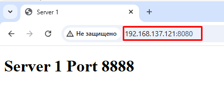
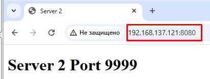
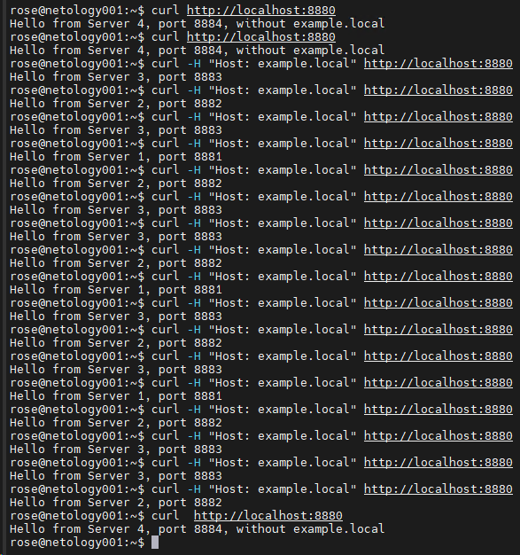

# "`Кластеризация и балансировка нагрузки`" - `Родионов Сергей`

### Задание 1

- Запустите два simple python сервера на своей виртуальной машине на разных портах
- Установите и настройте HAProxy, воспользуйтесь материалами к лекции по ссылке
- Настройте балансировку Round-robin на 4 уровне.
- На проверку направьте конфигурационный файл haproxy, скриншоты, где видно перенаправление запросов на разные серверы при обращении к HAProxy.

Конфигурационный файл [haproxy.cfg](./img/10-02/10-02-1/haproxy.cfg)

Cкриншоты с перенаправлением запросов на разные серверы:

- Server 2 выключен

    

- Server 2 включен

    

---

### Задание 2

- Запустите три simple python сервера на своей виртуальной машине на разных портах
- Настройте балансировку Weighted Round Robin на 7 уровне, чтобы первый сервер имел вес 2, второй - 3, а третий - 4
- HAproxy должен балансировать только тот http-трафик, который адресован домену example.local
- На проверку направьте конфигурационный файл haproxy, скриншоты, где видно перенаправление запросов на разные серверы при обращении к HAProxy c использованием домена example.local и без него.

Конфигурационный файл [haproxy.cfg](./img/10-02/10-02-2/haproxy.cfg)

Cкриншоты с перенаправлением запросов на разные серверы:

---