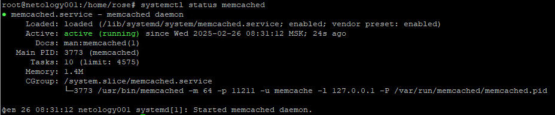
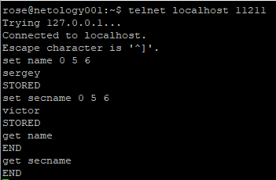
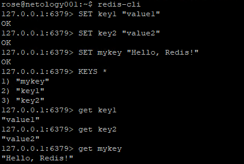

# Домашнее задание к занятию «Кеширование Redis/memcached» - `Родионов Сергей`

## Задание 1. Кеширование 

Приведите примеры проблем, которые может решить кеширование. 

Кеширование — это мощный инструмент для оптимизации производительности систем, который позволяет решать множество проблем. Вот основные примеры:

### 1. **Ускорение доступа к данным**
   - **Проблема:** Медленное выполнение запросов к базам данных или внешним API из-за высокой нагрузки или сложных вычислений.
   - **Решение:** Кеширование результатов запросов или часто используемых данных в оперативной памяти (например, Redis, Memcached) позволяет значительно ускорить доступ к ним.

### 2. **Снижение нагрузки на серверы**
   - **Проблема:** Высокая нагрузка на серверы из-за повторяющихся запросов к одним и тем же данным.
   - **Решение:** Кеширование статических или редко изменяющихся данных (например, HTML-страниц, изображений) снижает количество запросов к серверу, уменьшая нагрузку.

### 3. **Улучшение отзывчивости приложений**
   - **Проблема:** Пользователи испытывают задержки при работе с приложением из-за медленной обработки запросов.
   - **Решение:** Кеширование данных на стороне клиента (например, в браузере) или на промежуточных серверах (CDN) ускоряет загрузку контента.

### 4. **Оптимизация работы с внешними API**
   - **Проблема:** Ограничения на количество запросов к внешним API (rate limiting) или высокая стоимость таких запросов.
   - **Решение:** Кеширование ответов от внешних API позволяет сократить количество запросов и избежать превышения лимитов.

### 5. **Снижение задержек в распределенных системах**
   - **Проблема:** Высокие задержки при обращении к данным, которые хранятся в удаленных географически расположенных серверах.
   - **Решение:** Использование кеширования на edge-серверах (например, CDN) позволяет доставлять контент быстрее, сокращая задержки.

### 6. **Экономия ресурсов базы данных**
   - **Проблема:** Высокая нагрузка на базу данных из-за частых запросов на чтение.
   - **Решение:** Кеширование результатов запросов к базе данных снижает количество обращений к ней, что экономит ресурсы и увеличивает производительность.

### 7. **Улучшение производительности при высоких нагрузках**
   - **Проблема:** Система не справляется с пиковыми нагрузками, например, во время распродаж или крупных событий.
   - **Решение:** Кеширование страниц или данных позволяет обрабатывать больше запросов без увеличения нагрузки на серверы.

### 8. **Снижение затрат на инфраструктуру**
   - **Проблема:** Высокие затраты на масштабирование серверов или баз данных для обработки растущего числа запросов.
   - **Решение:** Кеширование позволяет уменьшить количество запросов к основным ресурсам, что снижает затраты на инфраструктуру.

### 9. **Ускорение загрузки веб-страниц**
   - **Проблема:** Медленная загрузка страниц из-за большого количества запросов к серверу.
   - **Решение:** Кеширование статических ресурсов (CSS, JavaScript, изображения) в браузере или на CDN ускоряет загрузку страниц.

### 10. **Обработка временных данных**
   - **Проблема:** Необходимость временного хранения данных, которые часто изменяются или устаревают (например, сессии пользователей, результаты поиска).
   - **Решение:** Кеширование таких данных в памяти позволяет быстро их извлекать и обновлять.

### 11. **Повышение отказоустойчивости**
   - **Проблема:** В случае сбоя основного источника данных (например, базы данных) приложение перестает работать.
   - **Решение:** Кеширование критически важных данных позволяет временно обслуживать запросы даже при недоступности основного источника.

### 12. **Оптимизация работы с медленными дисками**
   - **Проблема:** Медленный доступ к данным, хранящимся на HDD или в облачных хранилищах.
   - **Решение:** Кеширование данных в оперативной памяти или на SSD ускоряет доступ к ним.

Кеширование — это универсальное решение, которое может быть применено в различных сценариях для повышения производительности, снижения затрат и улучшения пользовательского опыта. Однако важно правильно настраивать сроки жизни кеша и механизмы его обновления, чтобы избежать устаревания данных.

---

## Задание 2. Memcached

Установите и запустите memcached.

---

## Задание 3. Удаление по TTL в Memcached

Запишите в memcached несколько ключей с любыми именами и значениями, для которых выставлен TTL 5. 

---

## Задание 4. Запись данных в Redis

Запишите в Redis несколько ключей с любыми именами и значениями. 

