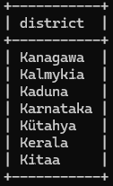
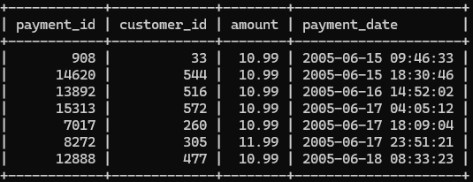
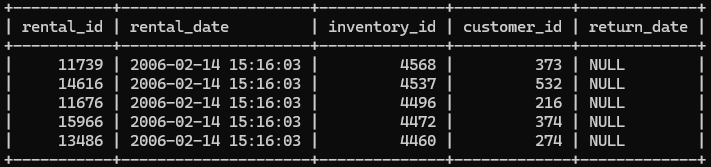
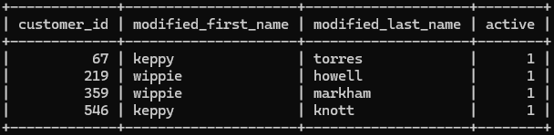

# Домашнее задание к занятию «SQL. Часть 1» - Родионов Сергей

## Задание 1

Получите уникальные названия районов из таблицы с адресами, которые начинаются на “K” и заканчиваются на “a” и не содержат пробелов.

```sql
SELECT DISTINCT district
FROM address
WHERE district LIKE 'K%a' 
  AND district NOT LIKE '% %'
  AND district NOT LIKE '';
```
Результат запроса:



## Задание 2
Получите из таблицы платежей за прокат фильмов информацию по платежам, которые выполнялись в промежуток с 15 июня 2005 года по 18 июня 2005 года **включительно** и стоимость которых превышает 10.00.
```sql
SELECT payment_id, customer_id, amount, payment_date
FROM payment
WHERE payment_date BETWEEN '2005-06-15 00:00:00' AND '2005-06-18 23:59:59'
  AND amount > 10.00
ORDER BY payment_date;
```
Результат запроса:



## Задание 3

Получите последние пять аренд фильмов.
```sql
SELECT rental_id, rental_date, inventory_id, customer_id, return_date
FROM rental
ORDER BY rental_date DESC
LIMIT 5;
```
Результат запроса:



## Задание 4
Одним запросом получите активных покупателей, имена которых Kelly или Willie. 

Сформируйте вывод в результат таким образом:
- все буквы в фамилии и имени из верхнего регистра переведите в нижний регистр,
- замените буквы 'll' в именах на 'pp'.
```sql
SELECT 
    customer_id,
    CASE 
        WHEN first_name = 'Kelly' THEN REPLACE(LOWER(first_name), 'll', 'pp')
        WHEN first_name = 'Willie' THEN REPLACE(LOWER(first_name), 'll', 'pp')
        ELSE LOWER(first_name)
    END AS modified_first_name,
    LOWER(last_name) AS modified_last_name,
    active
FROM customer
WHERE (first_name = 'Kelly' OR first_name = 'Willie')
  AND active = 1;
```
Результат запроса:


