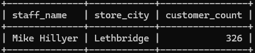
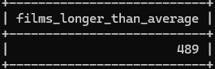
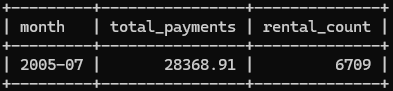

# Домашнее задание к занятию «SQL. Часть 2» - Родионов Сергей

## Задание 1

Одним запросом получите информацию о магазине, в котором обслуживается более 300 покупателей, и выведите в результат следующую информацию: 
- фамилия и имя сотрудника из этого магазина;
- город нахождения магазина;
- количество пользователей, закреплённых в этом магазине.

```sql
SELECT 
    CONCAT(s.first_name, ' ', s.last_name) AS staff_name,
    c.city AS store_city,
    COUNT(cu.customer_id) AS customer_count
FROM store st
JOIN staff s ON st.manager_staff_id = s.staff_id
JOIN address a ON st.address_id = a.address_id
JOIN city c ON a.city_id = c.city_id
JOIN customer cu ON st.store_id = cu.store_id
GROUP BY st.store_id, s.first_name, s.last_name, c.city
HAVING COUNT(cu.customer_id) > 300;
```
Результат запроса:



## Задание 2

Получите количество фильмов, продолжительность которых больше средней продолжительности всех фильмов.

```sql
SELECT COUNT(*) AS films_longer_than_average
FROM film
WHERE length > (SELECT AVG(length) FROM film);
```
Результат запроса:



## Задание 3

Получите информацию, за какой месяц была получена наибольшая сумма платежей, и добавьте информацию по количеству аренд за этот месяц.

```sql
WITH monthly_stats AS (
    SELECT 
        DATE_FORMAT(payment_date, '%Y-%m') AS month,
        SUM(amount) AS total_payments,
        COUNT(DISTINCT rental_id) AS rental_count
    FROM payment
    GROUP BY DATE_FORMAT(payment_date, '%Y-%m')
)
SELECT * FROM monthly_stats
ORDER BY total_payments DESC
LIMIT 1;
```
Результат запроса:



