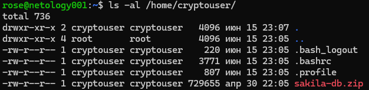
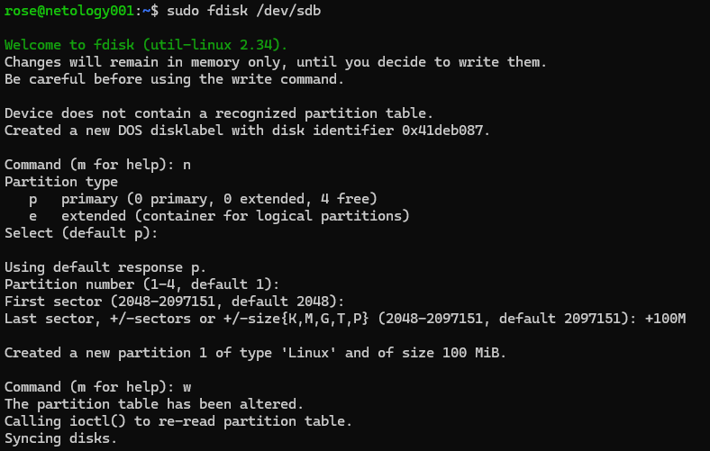
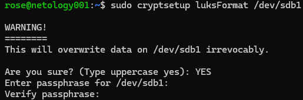
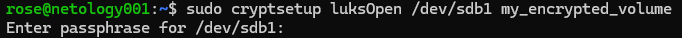
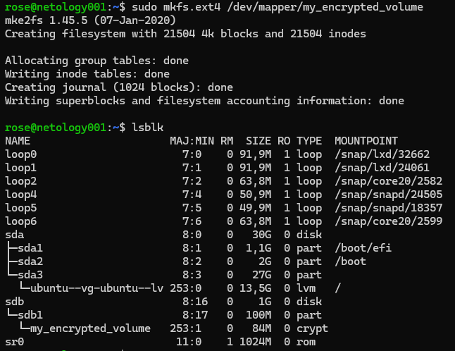

# Домашнее задание к занятию «Защита хоста» - Родионов Сергей

## Задание 1

1. Установите **eCryptfs**.
2. Добавьте пользователя cryptouser.
3. Зашифруйте домашний каталог пользователя с помощью eCryptfs.

*В качестве ответа  пришлите снимки экрана домашнего каталога пользователя с исходными и зашифрованными данными.*  

Исходный каталог пользователя:

Каталог пользователя с зашифрованными данными:

## Задание 2

1. Установите поддержку **LUKS**.
2. Создайте небольшой раздел, например, 100 Мб.
3. Зашифруйте созданный раздел с помощью LUKS.

*В качестве ответа пришлите снимки экрана с поэтапным выполнением задания.*

Шаг 1: Создание раздела с помощью fdisk:

Шаг 2: Шифрование раздела с LUKS:

Шаг 3: Открытие зашифрованного тома:

Шаг 4: Создание файловой системы:

