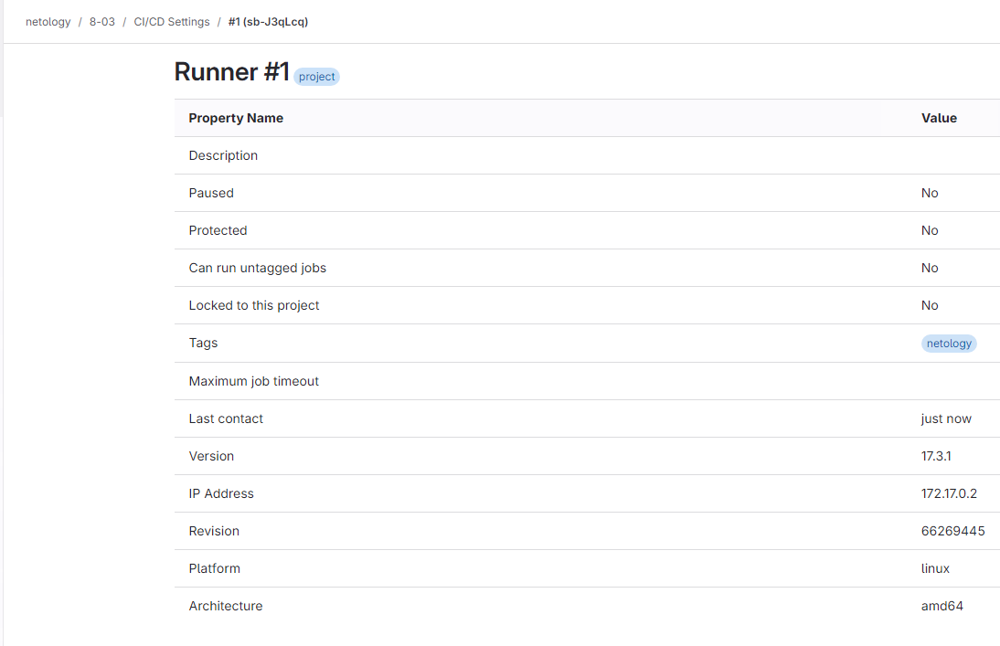
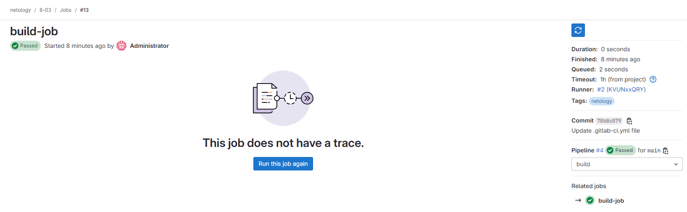

# "`GitLab`" - `Родионов Сергей`

### Задание 1

Настройки раннера:

---

### Задание 2

[gitlab-ci.yml](./img/8-03-2/gitlab-ci.yml)

[Вывод stage: test](./img/8-03-2/console.txt)

Результат stage: build

