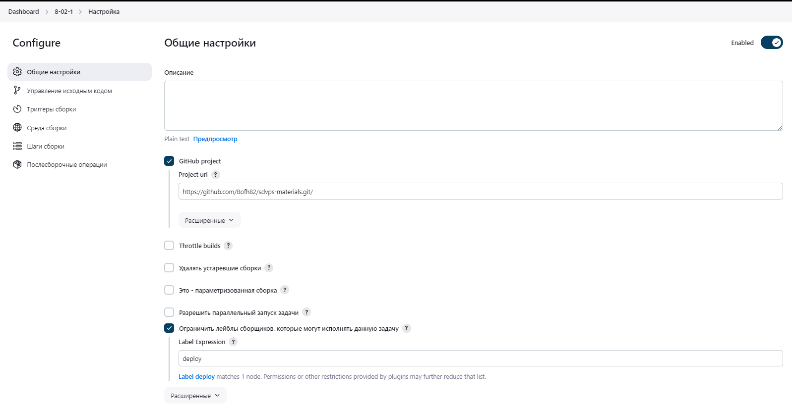
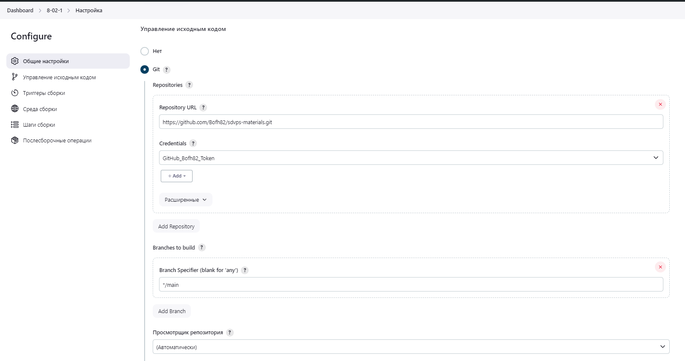
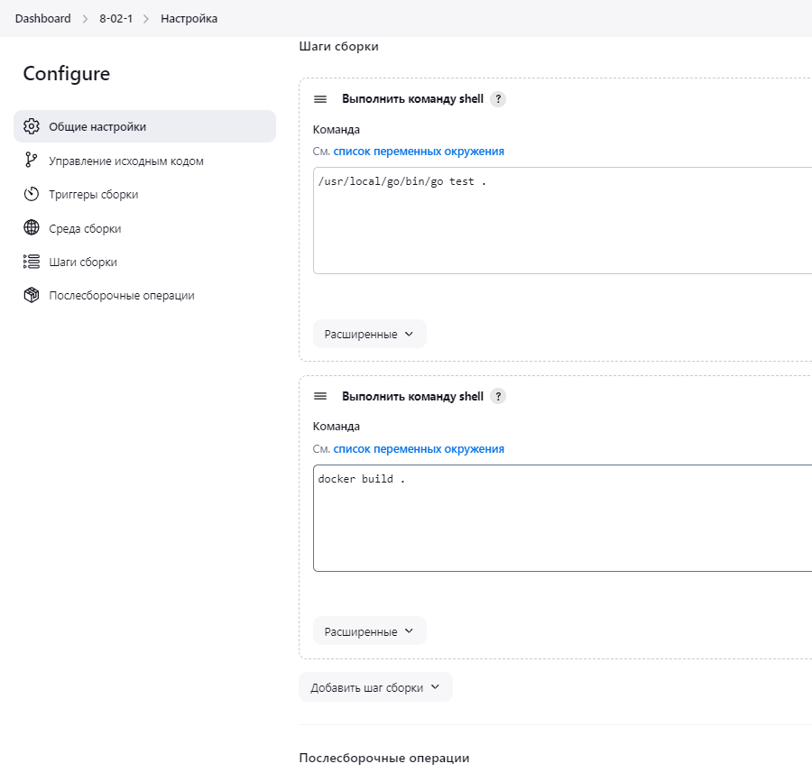
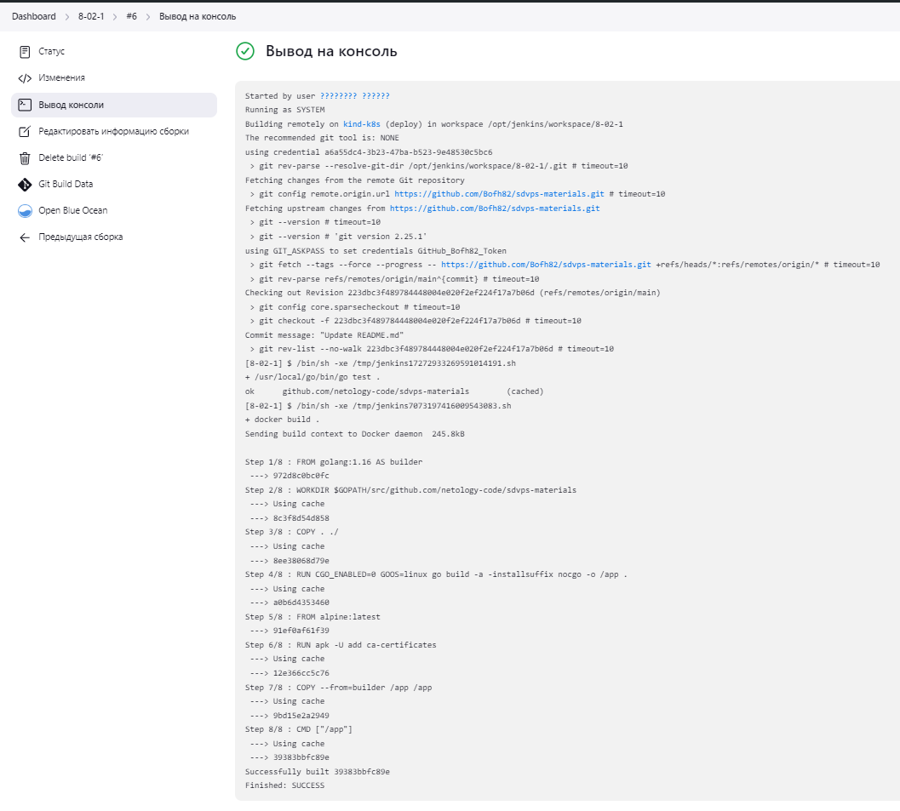

# "`Что такое DevOps. CI/CD`" - `Родионов Сергей`

### Задание 1

Настройки проекта:

Вывод консоли:

---

### Задание 2

[Pipeline script](./img/8-02-2/pipeline.groovy)

[Вывод консоли](./img/8-02-2/console.txt)

---

### Задание 3

[Pipeline script](./img/8-02-3/pipeline.groovy)

[Вывод консоли](./img/8-02-3/console.txt)
