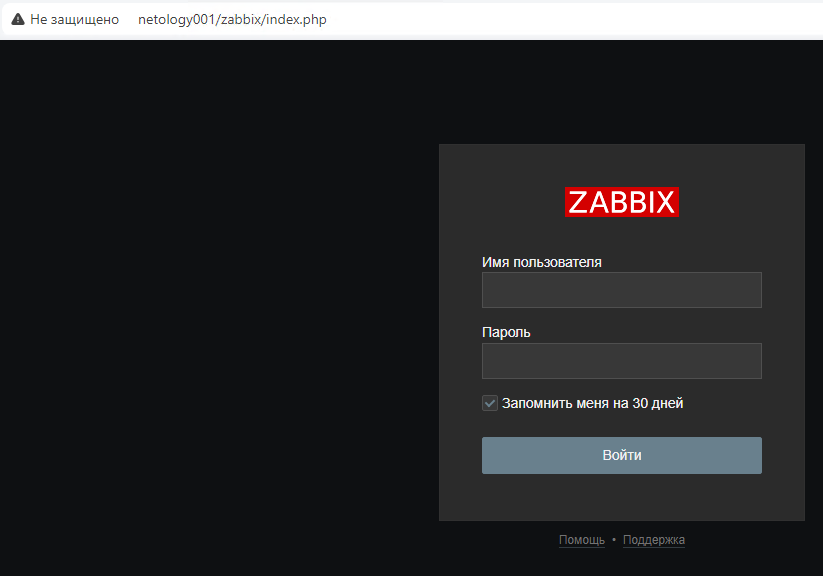
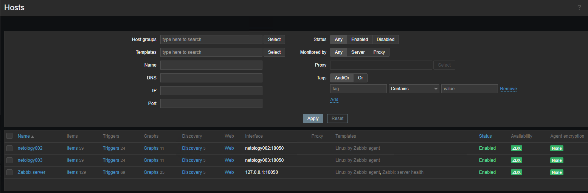
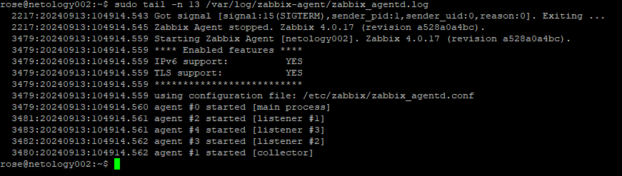
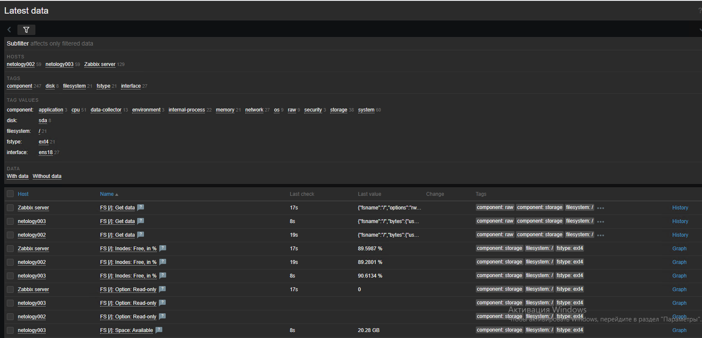

# "`Система мониторинга Zabbix`" - `Родионов Сергей`

### Задание 1

Скриншот авторизации в админке:

Список команд для установки zabbix:

[zabbix-install.md](./img/9-02/9-02-1/zabbix-install.md)

---

### Задание 2

Cкриншот раздела Configuration > Hosts

Скриншот лога zabbix agent

Скриншот раздела Monitoring > Latest data

Текст использованных команд. Для разворачивания использовал ansible
[zabbix-agent.yaml](./img/9-02/9-02-2/zabbix-agent.yaml)
