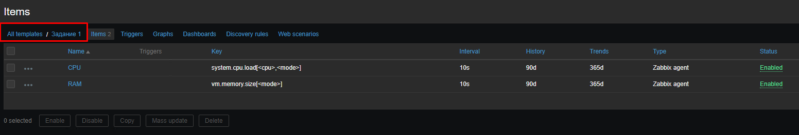
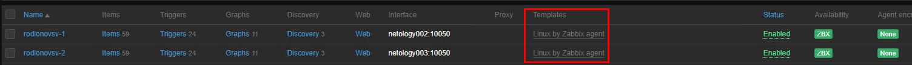
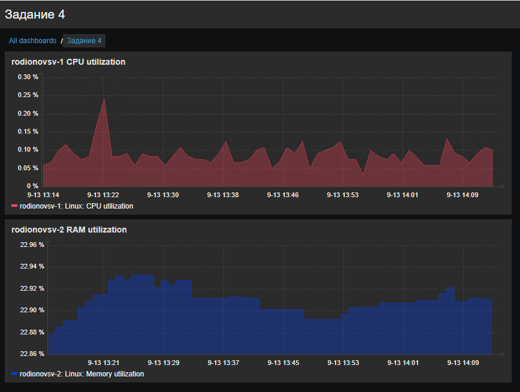

# "`Система мониторинга Zabbix. Часть 2`" - `Родионов Сергей`

### Задание 1

Cкриншот страницы шаблона с названием «Задание 1».

---

### Задание 2-3

Cкриншот страницы хостов, где будут видны привязки шаблонов с названиями «Задание 2-3».

---

### Задание 4

Cкриншот дашборда с названием «Задание 4»

---
